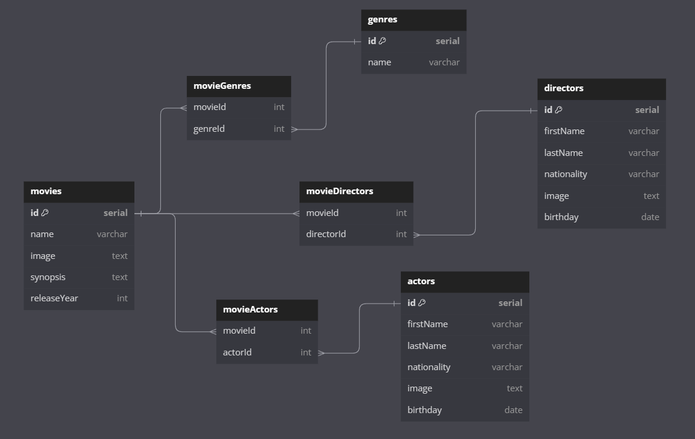

# Project Deliverable-03: API for Movie Application

This project is an API for managing a database of movies, actors, directors and genres. It uses Express.js as backend framework and Sequelize as ORM to interact with a SQL database.

# Project Description

The API allows to perform CRUD (Create, Read, Update, Delete) operations on movie, actor, director and genre models. In addition, many-to-many relationships can be established between movies and their genres, actors and directors. The API also includes specific endpoints to modify the associations of a movie with its genres, actors and directors.

# Technologies Used

- Node.js: Runtime environment for JavaScript.
- Express.js: Web framework for Node.js.
- Sequelize: ORM for Node.js that supports SQL databases.
- PostgreSQL: Relational database used (can be replaced by any other SQL database).

# Attached is a link to dbDiagram:

https://dbdiagram.io/d/Movies_db-66adafe08b4bb5230e1b8bac

